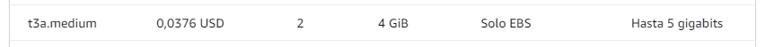

# Cloud Computing: Trabajo de Investigación

## 1. VM en Proovedores líderes de Cloud Computing

### 1.1 Regiones y Zonas de disponibilidad o equivalente.

Una **región** es una ubicación física geográfica, donde se encuentran zonas de disponibilidad que albergan centro de datos ó **data centers** de algún proveedor de Cloud Computing. En una región pueden existir muchas zonas de disponibilidad (**Availability Zone**), pero como mínimo se espera que 3, pues si una de estas **AZ** llega a caerse existe un respaldo de conexión en la misma región (**Zone-Redundant**). 

#### 1.1.1 Amazon Web Services

Según su propio sitio web, dentro de la sección [global infrastructure](https://aws.amazon.com/about-aws/global-infrastructure/), se determina que al momento de redactar este trabajo de investigación, **Amazon Web Services** cuenta con 102 zonas de disponibilidad (*availability zone*) dentro de 32 regiones alrededor del mundo.

#### 1.1.2 Microsoft Azure

Azure cuenta con un apartado de documentación, tutoriales y guías donde fue posible hallar las regiones y zonas de disponibilidad de las cuales brindan sus servicios. No obstante guiándome de su apartado [learn.microsoft](https://learn.microsoft.com/en-us/azure/reliability/availability-zones-service-support) y su apartado interactivo web [Azure geographies](https://azure.microsoft.com/en-us/explore/global-infrastructure/geographies/#overview), podemos decir que Azure cuenta con soporte para más de 60 regiones.

No se menciona oficialmente pero considerando la premisa de Azure por otorgar como mínimo 3 zonas de disponibilidad, entonces estaríamos hablando de como mínimo $60 \cdot 3 \approx 120$ zonas de disponibilidad a su cargo. 

#### 1.1.3 Google Cloud

El gigante de Google anuncia en su sitio web [google cloud](https://cloud.google.com/about/locations?hl=es) que cuenta hasta la fecha con 37 regiones y 112 zonas de disponibilidad. No obstante en su mismo sitio prometen que están trabajando para extenderse a 11 nuevas zonas.

### 1.2 Precios para Máquinas Virtuales

En este caso para la búsqueda de precio de cada proveedor vamos a comparar en base al modelo más económico que hemos armado, este contará con 2 vCPU, 2 GB de RAM, 10 GB SSD y su región será la costa este de Estados Unidos (**EAST-US**).

No obstante la máquina virtual tendrá un sistema Linux y usará la distribución de Ubuntu. Además estará dentro de la categoría de **Uso general**.

#### 1.2.1 Amazon Web Services

Para el caso de AWS contamos con diferentes instancias que cumplen con el cometido requerido, no obstante para este caso elegimos la instancia [t3a small](https://aws.amazon.com/ec2/pricing/on-demand/). Tiene un precio de $0.0188\$$ la hora, el problema es que debemos sumarle a ello un almacenamiento del tipo [EBS](https://aws.amazon.com/ebs/pricing/) que cuesta aproximadamente $3.00\$$ mensuales con 10GB.

    

Es así que el total nos da $(0.0188 \cdot 24 \cdot 30) + 3.00 = 16.54 \$$ dolares mensuales.

#### 1.2.2 Microsoft Azure

Para el caso de Microsoft Azure dentro de su [calculadora](https://azure.microsoft.com/es-es/pricing/calculator/) de precios seleccionamos la instancia [Av2 series v2](https://learn.microsoft.com/en-us/azure/virtual-machines/av2-series). Esta cuesta con un costo aproximado de $0.043\$$ por hora. Es decir esto nos daría un costo aproximado de $31.39$$ mensualmente, además debemos considerar que estamos cotizando con un vCPU menos (*modelo más cercano*).

    

#### 1.2.3 Google Cloud

En este caso, a partir de su modelo de creación por [calculadora](https://cloud.google.com/products/calculator#id=abf90f35-0d04-4796-91a9-8ee4889cf5cb), pudimos encontrar nuestro modelo planteado anteriormente, el cual nos arrojó un costo aproximado de $13.63\$$ y en conjunto con el almacenamiento SSD de 10GB $1.70 \$$, por lo que el costo final es $15.33 \$$ mensuales, muy parecido al de AWS. 

    

### 1.3 Comparación entre los 3 proveedores. Máquinas pequeñas/medianas/grandes.

Para poder realizar una mejor comparación entre los 3 proveedores, verificaremos los precios de la región de la costa este en los Estados Unidos (**EAST-US**) para cada uno, basándonos en el caso de que la máquina será usada 24 horas, 7 días a la semana.
A su vez, tomaremos como referencia la "máquina de uso general" de cada proveedor, que es la que más se asemeja a la máquina que estamos buscando.

#### 1.3.1 Máquinas de Amazon

Amazon Web Services describe a sus máquinas [t3a](https://aws.amazon.com/es/ec2/instance-types/) como "el tipo de instancia de uso general ampliable de última generación". Están diseñadas para todo tipo de aplicaciones que requieran un uso moderado del procesador, donde a veces pueden experimentar tipos de uso. Al ser de uso general, ofrecen hasta un 10% de ahorro en costos comparado a otras instancias. 

##### 1.3.1.1 Máquina pequeña

    

Ya habíamos planteado las especificaciones y precios de esta máquina previamente. Posee un precio de $0.0188\$$ la hora, sumado al precio de aproximadamente $3.00\$$ mensuales con 10GB de almacenamiento en EBS(Elastic Block Store).
En total, el precio sería: 
$(0.0188 \cdot 24 \cdot 30) + 3.00 = 16.54 \$$ dólares mensuales.

##### 1.3.1.2 Máquina mediana

    

Esta máquina nos ofrece la misma capacidad de CPU que la anterior, solo que duplica la cantidad de memoria RAM disponible, al igual que su precio, que es de $0.0376\$$ la hora. A su vez, tenemos que sumarle el precio de almacenamiento en EBS. Ya que estamos tomando en cuenta una máquina superior, supondremos que necesitaremos un almacenamiento de 20GB de almacenamiento general (gp3), que ofrece un precio de $0.08\$$ por gigabyte de uso. El total sería:

$(0.0376 \cdot 24 \cdot 30) + 0.08 \cdot 20 = 28.672 \$$ dólares mensuales.

##### 1.3.1.3 Máquina grande

    

Nuevamente tenemos la misma capacidad de CPU que la máquina anterior. Aquí vamos encontrando el patrón de Amazon Web Services. Hasta cierto punto, duplica la cantidad de memoria RAM disponible y el precio, que en este caso es de $0.0752\$$ la hora. Hay que sumarle el precio de almacenamiento en EBS. Tomaremos el caso donde necesitaremos el doble  de almacenamiento general (gp3), es decir 40 GB. El total sería:

$(0.0752 \cdot 24 \cdot 30) + 0.08 \cdot 40 = 57.344\$$ dólares mensuales.

#### 1.3.2 Máquinas de Microsoft Azure

Para el caso de Microsoft Azure tomaremos como referencia la máquina [Av2 series v2](https://learn.microsoft.com/en-us/azure/virtual-machines/av2-series) mencionada anteriormente. Microsoft las describe como "máquinas virtuales con configuraciones de rendimiento de CPU y memoria más adecuadas para cargas de trabajo de nivel de entrada, como desarrollo y pruebas."

##### 1.3.2.1 Máquina pequeña

    

Esta máquina nos ofrece 1 núcleo de procesamiento, 2 GB de memoria RAM y 10GB de almacenamiento temporal. Su precio es de $0.043\$$ la hora. La página oficial de Microsoft Azure realiza el cálculo por nosotros, indicando un precio promedio de $31.39\$$ mensuales.

    

##### 1.3.2.2 Máquina mediana

    

Esta máquina nos ofrece 2 núcleos de procesamiento, 4 GB de memoria RAM y 20GB de almacenamiento temporal. Su precio es de $0.091\$$ la hora. La página oficial de Microsoft Azure realiza el cálculo por nosotros, indicando un precio promedio de $66.43\$$ mensuales.

    

##### 1.3.2.3 Máquina grande

    

Esta máquina nos ofrece 4 núcleos de procesamiento, 8 GB de memoria RAM y 40GB de almacenamiento temporal. Su precio es de $0.191\$$ la hora. La página oficial de Microsoft Azure realiza el cálculo por nosotros, indicando un precio promedio de $139.43\$$ mensuales.

    

#### 1.3.3 Máquinas de Google Cloud

##### 1.3.3.1 Máquina pequeña

##### 1.3.3.2 Máquina mediana

##### 1.3.3.3 Máquina grande

### 1.4 Imágenes y diagramas

### 1.5 Referencias APA

- https://azure.microsoft.com/es-es/explore/global-infrastructure
- https://aws.amazon.com/about-aws/global-infrastructure/
- https://cloud.google.com/products/calculator#id=abf90f35-0d04-4796-91a9-8ee4889cf5cb
- https://aws.amazon.com/ec2/pricing/on-demand/
- https://learn.microsoft.com/en-us/azure/virtual-machines/av2-series
- https://aws.amazon.com/es/ec2/instance-types/
- https://cloud.google.com/compute?hl=es#section-6
- https://cloud.google.com/compute/docs/machine-types#e2_machine_types

---

## 2. Caso de evaluación de costos de VM

La Organización de las Naciones Unidas (ONU) desea procesar los datos de censos de población y vivienda de cada uno de sus 193 países miembro para poder establecer un mapa de pobreza mundial y poder brindar ayuda de salud y humanitaria en el futuro. Por política de privacidad de datos, la ONU le pide que las máquinas virtuales se sitúen en Europa.

La ONU necesita una gran potencia de computación por 90 días y su equipo técnico ha estimado lo siguiente:

- 80 máquinas virtuales Linux cada una con 2 CPU y 4 GB de RAM y 20 GB de disco SSD de HW como mínimo para hacer los cálculos.
- 10 máquinas virtuales Linux cada una con 4 CPU y 8 GB de RAM y 500 GB de disco SSD de HW como mínimo para la base de datos.

### 2.1 Región para cada proveedor y argumentar elección

### 2.2 Tamaño de máquinas virtuales más adecuado para cada proveedor

### 2.3 Calcular costos de Compute y Storage.

### 2.4 Recomendación de proveedor

### 2.5 Imágenes y Diagramas

### 2.6 Referencias APA